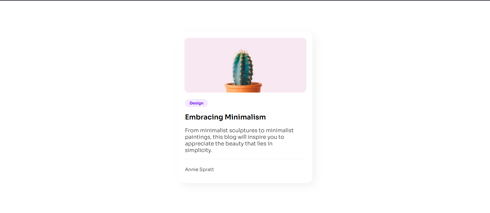

# DevChallenges.io - Minimal Blog Card

## Welcome! 👋

Welcome to this responsive web coding challenge.

## The challenge

The task was to create a simple blog card that includes an image, a title, a short description, and a tag which has been done successfully.

## Built With
- HTML5
- CSS3

## Live Demo Link
[Minimal Blog Card](https://minimal-blog-card-phi.vercel.app/)

## Author 

👤 **Emmanuelle Kamwa**

-   Github: [@emmanuellekamwa](https://github.com/emmanuellekamwa)
-   Twitter: [@AlixKamwa](https://twitter.com/AlixKamwa)
-   Linkedin: [emmanuelle-kamwa-86145a1a4](https://www.linkedin.com/in/emmanuelle-kamwa-86145a1a4/)

## Contributing

Contributions, issues and feature requests are welcome!

Feel free to check the issues page.

# Show Some Support

Give a ⭐ if you've liked my project and your comments are highly accepted.

## License

This project is MIT licensed.